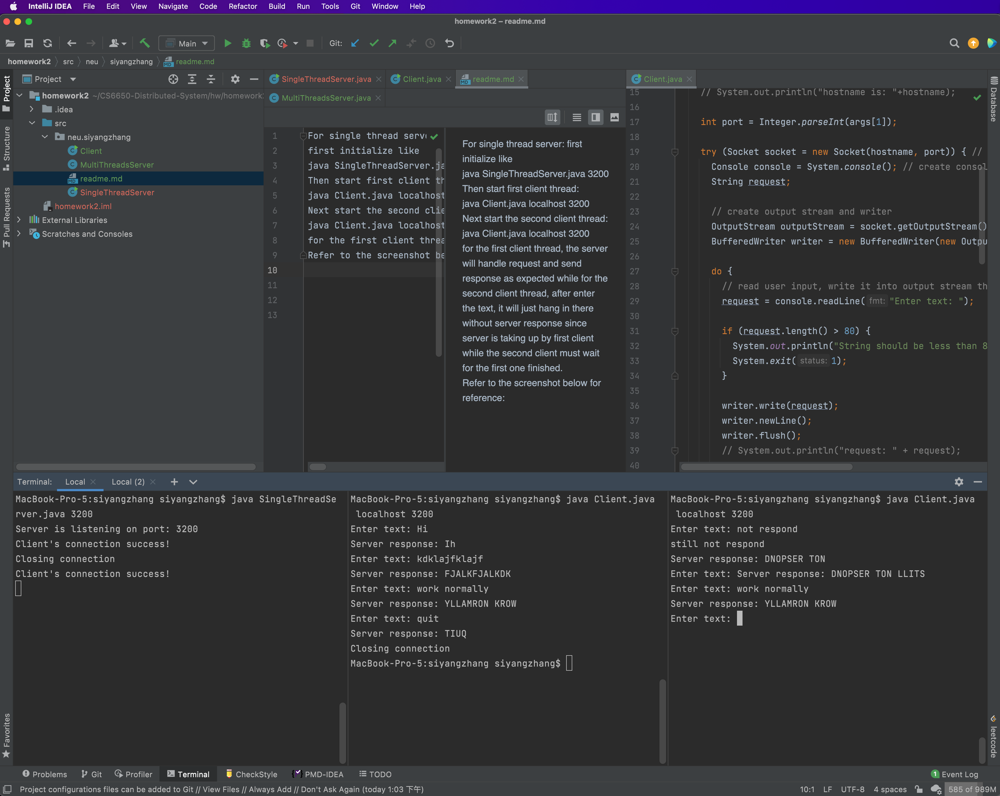

For single thread server:   
first initialize like      
java SingleThreadServer.java 3200    
Then start first client thread:    
java Client.java localhost 3200   
Next start the second client thread:
java Client.java localhost 3200       
    
for the first client thread, the server will handle request and send response as expected while for the second client thread, after enter the text, it will just hang in there without server response since server is taking up by first client while the second client must wait for the first one finished.    

Refer to the screenshot below for reference:   

