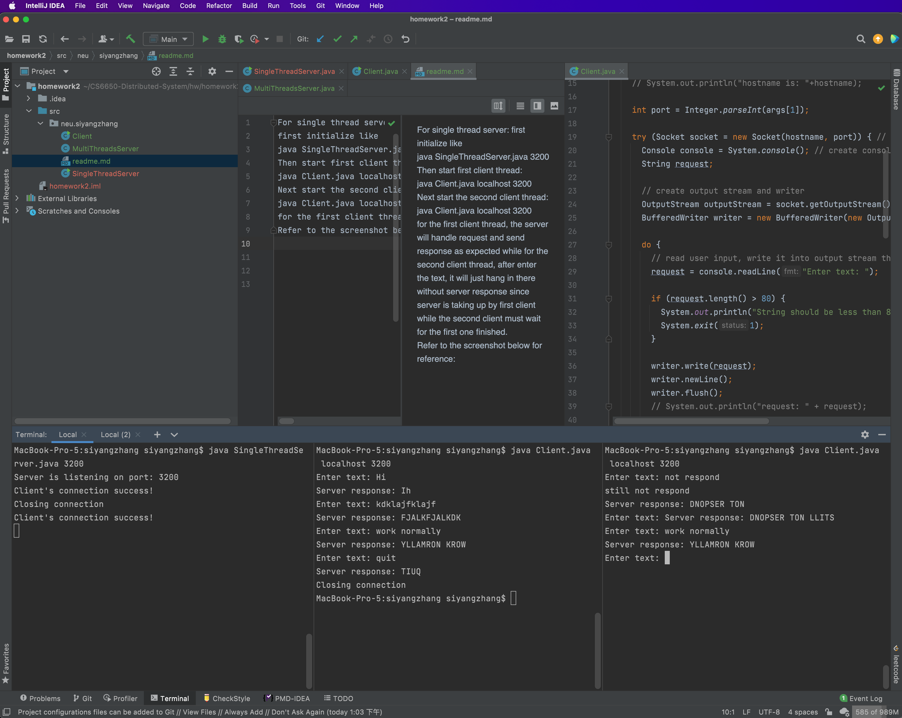
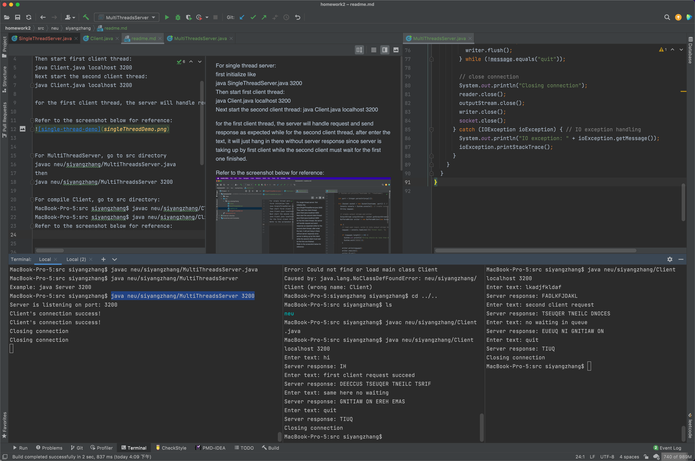

For single thread server:   
first initialize like      
java SingleThreadServer.java 3200    
or compile first:   
MacBook-Pro-5:src siyangzhang$ javac neu/siyangzhang/SingleThreadServer.java    
MacBook-Pro-5:src siyangzhang$ java neu/siyangzhang/SingleThreadServer 3200
 
Then start first client thread:    
java Client.java localhost 3200   
Next start the second client thread:
java Client.java localhost 3200  

    
for the first client thread, the server will handle request and send response as expected while for the second client thread, after enter the text, it will just hang in there without server response since server is taking up by first client while the second client must wait for the first one finished.    

Refer to the screenshot below for reference:   

For MultiThreadServer, go to src directory   
javac neu/siyangzhang/MultiThreadsServer.java   
then    
java neu/siyangzhang/MultiThreadsServer 3200

For compile Client, go to src directory:    
javac neu/siyangzhang/Client.java    
java neu/siyangzhang/Client localhost 3200
at a new terminal to create another client request:    
java neu/siyangzhang/Client localhost 3200
Refer to the screenshot below for reference:

