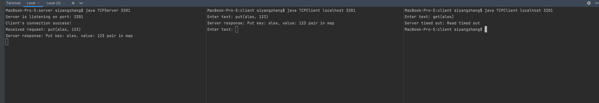

<h3>Assignment overview<h3/>
The purpose of this assignment is to learn the characteristics, principles of TCP and UDP client-server model by implementing them respectively.    

TCP is a connection-based protocol where communication between client and server needs to set up first, and is guarantee the delivery and order of data sent, could be implemented with multiple error-checking mechanisms. Sequence of data is sent during transmission.    

As for UDP, which sends data by datagram packets, is a connection-less protocol therefore doesn't need set up before use, while the delivery and order of data sent is not reliable and only allow limited error checking mechanism like check-sum. Because of its relative-simpleness, the speed of UDP is faster than TCP and overhead is lower.    

Apart from the feature of TCP and UDP, I also practice implement server side logging mechanism, by setting up a basic hashmap including exception handling to see how server should handle client request, start from set up socket(stream for TCP and datagram for UDP), create buffer/read write stream to allow read client's request, process it, extract the specific operation type(get, delete, put) and perform on server's storage, and logging into log file with format and timestamp, finally sent response back to client.   

For the client side, I create socket with given server hostname and port number, add time-out mechanism and exception handling, use console to allow client input request, send client request to server and wait for response, log both request and response with timestamp.   

Above as a basic client-server model implementation provide me with deeper understanding about TCP/UDP, socket/datagram communication, client-server model, potential exception during data transmission process and its handling.  

<h3>Technical impression<h3/> 

I start this assignment by learning the fundamental knowledge about TCP/IP, socket/datagram communication from a high level. Then create a general plan about code structure, like two set of client-server models, one for TCP and the other for UDP, during the implementation process, I find that both TCP and UDP share some common code, like Logger code block and request handling part, therefore I get into refactoring after the general implementation is done. Another thing to mention is the logging part, I learn how to get timestamp and format it, refresh the knowledge about writing into a file, and exception handling, which all reminds me of the last internship I did at Index Exchange as software developer at cloud platform team, where the majority job is to get logging file into company's current ELK(elastic search, filebeat and Kibana) stack with certain formatting with json, the logging file is important for a product's operation monitoring, to see the workload performance, to avoid service failure or lagging.   

One problem I face is during set up UDP communication, because I want to enable client to be able to constantly send datagram instead of just send and quit (which implemented by a while loop, but lacking the check of datagram itself, leading to the scenario where client is continuously sending to server which quickly create a large log file at server side).

The solution to this is I add a simple if check to only send valid datagram which is not zero, and to avoid adding another loop within while loop, which could lead to infinite loop and quickly create a giant log file, dragging down the performance of the whole service.   

<h3>How to Run:<h3/>

I use two separate client-server pairs, one for TCP and the other for UDP.   

Go to src folder under client and server, first compile clients like below:    
```
MacBook-Pro-5:client siyangzhang$ javac TCPClient.java 
MacBook-Pro-5:client siyangzhang$ javac UDPClient.java
```   
then go to server folder and compile TCP server and UDP server like below:   
```
MacBook-Pro-5:server siyangzhang$ javac TCPServer.java 
MacBook-Pro-5:server siyangzhang$ javac UDPServer.java 
```    
next start server first then start client at another terminal:    
start server with given port number:
```
MacBook-Pro-5:server siyangzhang$ java TCPServer 3201
Server is listening on port: 3201
Client's connection success!
Received request: put(alex,123)
Server response: Put key: alex, value: 123 pair in map
```
start client and connect to server address and port:    
```
MacBook-Pro-5:client siyangzhang$ java TCPClient localhost 3201
Enter text: put(alex,123)
Server response: Put key: alex, value: 123 pair in map
Enter text: 
```   
same logic applies to UDP client and server.    
Note that both clients share the one logger(ClientLogger class) writing into one file name clientLog.txt   
both servers share one logger(ServerLogger class) and write into one file name serverLog.txt

<h3>Examples with description:<h3/>

TCP example:    
first pre-populate some key-value pairs before five of each operation:    
Client side console:
```
MacBook-Pro-5:client siyangzhang$ java TCPClient localhost 3201
Enter text: put(alex, 1)
Server response: Put key: alex, value: 1 pair in map
Enter text: put(bill, 2)
Server response: Put key: bill, value: 2 pair in map
Enter text: PUT(Cindy, 3)
Server response: Put key: cindy, value: 3 pair in map
Enter text: PUT(Daniel, 4)
Server response: Put key: daniel, value: 4 pair in map
```
Serve side console:    
```
MacBook-Pro-5:server siyangzhang$ java TCPServer 3201
Server is listening on port: 3201
Client's connection success!
Received request: put(alex, 1)
Server response: Put key: alex, value: 1 pair in map
Received request: put(bill, 2)
Server response: Put key: bill, value: 2 pair in map
Received request: PUT(Cindy, 3)
Server response: Put key: cindy, value: 3 pair in map
Received request: PUT(Daniel, 4)
Server response: Put key: daniel, value: 4 pair in map
```    
<h4>Five of each operation, including cases like put(update) new value with existing/none-existing key, get value with existing/none-existing key, delete key-value with existing/none-existing key.</h4>    
Client side console:    
```
Enter text: get(alex    ) 
Server response: Didn't find matching value with given key: alex    
Enter text: get(alex)
Server response: Get value: 1 with given key: alex
Enter text: get(adfaaf)
Server response: Didn't find matching value with given key: adfaaf
Enter text: put(alex,3)
Server response: Put key: alex, value: 3 pair in map
Enter text: get(alex)
Server response: Get value: 3 with given key: alex
Enter text: put(adfadaf,5)
Server response: Put key: adfadaf, value: 5 pair in map
Enter text: delete(alex)
Server response: Delete value: 3 with given key: alex
Enter text: get(alex)
Server response: Didn't find matching value with given key: alex
Enter text: delete(adfadaf)
Server response: Delete value: 5 with given key: adfadaf
Enter text: delete(adfafafaaaaa)
Server response: Didn't find matching value with given key: adfafafaaaaa
Enter text: quit
Server response:  Received quit request from 127.0.0.1 : 3201
Closing connection
MacBook-Pro-5:client siyangzhang$ 
```
Server side console:    
```
MacBook-Pro-5:server siyangzhang$ java TCPServer 3201
Server is listening on port: 3201
Client's connection success!
Received request: put(alex, 1)
Server response: Put key: alex, value: 1 pair in map
Received request: put(bill, 2)
Server response: Put key: bill, value: 2 pair in map
Received request: PUT(Cindy, 3)
Server response: Put key: cindy, value: 3 pair in map
Received request: PUT(Daniel, 4)
Server response: Put key: daniel, value: 4 pair in map
Received request: get(alex    )
key: alex    
Server response: Didn't find matching value with given key: alex    
Received request: get(alex)
key: alex
Server response: Get value: 1 with given key: alex
Received request: get(adfaaf)
key: adfaaf
Server response: Didn't find matching value with given key: adfaaf
Received request: put(alex,3)
Server response: Put key: alex, value: 3 pair in map
Received request: get(alex)
key: alex
Server response: Get value: 3 with given key: alex
Received request: put(adfadaf,5)
Server response: Put key: adfadaf, value: 5 pair in map
Received request: delete(alex)
key: alex
Server response: Delete value: 3 with given key: alex
Received request: get(alex)
key: alex
Server response: Didn't find matching value with given key: alex
Received request: delete(adfadaf)
key: adfadaf
Server response: Delete value: 5 with given key: adfadaf
Received request: delete(adfafafaaaaa)
key: adfafafaaaaa
Server response: Didn't find matching value with given key: adfafafaaaaa
Received request: quit
Closing connection
Server response:  Received quit request from 127.0.0.1 : 3201
Closing connection
```

<h4>Timeout Mechanism, set waiting time to 20s:</h4>
```
MacBook-Pro-5:client siyangzhang$ java TCPClient localhost 3201
Enter text: get(alex)
Server timed out: Read timed out
MacBook-Pro-5:client siyangzhang$ 
```
    

<h4>Invalid input example:</h4>    
Client side console:
```
MacBook-Pro-5:client siyangzhang$ java TCPClient localhost 3201
Enter text: put(alex, 123   )
Server response: Put key: alex, value: 123 pair in map
Enter text: gadfalfdk
Server response:  Received malformed request of length 9 from 127.0.0.1 : 3201
Enter text: 
```
Server side console:    
```
MacBook-Pro-5:server siyangzhang$ java TCPServer 3201
Server is listening on port: 3201
Client's connection success!
Received request: put(alex, 123   )
Server response: Put key: alex, value: 123 pair in map
Received request: gadfalfdk
Server response:  Received malformed request of length 9 from 127.0.0.1 : 3201
```
Exception handling example:    
Client side console:
```
MacBook-Pro-5:client siyangzhang$ java TCPClient localhost 3201
Enter text: put(adafda)
Invalid response
Closing connection
MacBook-Pro-5:client siyangzhang$ 
```
Server side console:
```
MacBook-Pro-5:server siyangzhang$ java TCPServer 3201
Server is listening on port: 3201
Client's connection success!
Received request: put(adafda)
Client input is invalid: Index 1 out of bounds for length 1
MacBook-Pro-5:server siyangzhang$ 
```    
<h4>client logging example:</h4> 
client log has two types, send and receive    
Send Format:    
Client send: `<client input>` from `<hostname>` at `<port>` to perform `<operation type>` operation at `<client time>` client time    
Receive Format:    
Client receive server response: `<server response>` from `<server address>` with `<operation type>` operation at `<client time>` client time
```
Client send: put(alex,1) from localhost at 3201 to perform PUT operation at 2022-05-27 22:10:18.992 client time
Client receive server response: Server response: Put key: alex, value: 1 pair in map from 127.0.0.1 with PUT operation at 2022-05-27 22:10:19.079 client time
Client send: put(bill, 2) from localhost at 3201 to perform PUT operation at 2022-05-27 22:10:24.146 client time
Client receive server response: Server response: Put key: bill, value: 2 pair in map from 127.0.0.1 with PUT operation at 2022-05-27 22:10:24.147 client time
Client send: PUT(Cindy, 3) from localhost at 3201 to perform PUT operation at 2022-05-27 22:10:28.970 client time
Client receive server response: Server response: Put key: cindy, value: 3 pair in map from 127.0.0.1 with PUT operation at 2022-05-27 22:10:28.971 client time
Client send: PUT(Daniel, 4) from localhost at 3201 to perform PUT operation at 2022-05-27 22:10:33.838 client time
Client receive server response: Server response: Put key: daniel, value: 4 pair in map from 127.0.0.1 with PUT operation at 2022-05-27 22:10:33.840 client time
Client send: get(alex    )  from localhost at 3201 to perform GET operation at 2022-05-27 22:10:41.322 client time
Client receive server response: Server response: Didn't find matching value with given key: alex     from 127.0.0.1 with GET operation at 2022-05-27 22:10:41.324 client time
Client send: get(alex) from localhost at 3201 to perform GET operation at 2022-05-27 22:10:45.417 client time
Client receive server response: Server response: Get value: 1 with given key: alex from 127.0.0.1 with GET operation at 2022-05-27 22:10:45.419 client time
Client send: get(adfaaf) from localhost at 3201 to perform GET operation at 2022-05-27 22:10:49.973 client time
Client receive server response: Server response: Didn't find matching value with given key: adfaaf from 127.0.0.1 with GET operation at 2022-05-27 22:10:49.975 client time
Client send: put(alex,3) from localhost at 3201 to perform PUT operation at 2022-05-27 22:10:53.484 client time
Client receive server response: Server response: Put key: alex, value: 3 pair in map from 127.0.0.1 with PUT operation at 2022-05-27 22:10:53.485 client time
Client send: get(alex) from localhost at 3201 to perform GET operation at 2022-05-27 22:10:57.410 client time
Client receive server response: Server response: Get value: 3 with given key: alex from 127.0.0.1 with GET operation at 2022-05-27 22:10:57.411 client time
Client send: put(adfadaf,5) from localhost at 3201 to perform PUT operation at 2022-05-27 22:11:01.224 client time
Client receive server response: Server response: Put key: adfadaf, value: 5 pair in map from 127.0.0.1 with PUT operation at 2022-05-27 22:11:01.226 client time
Client send: delete(alex) from localhost at 3201 to perform DELETE operation at 2022-05-27 22:11:04.880 client time
Client receive server response: Server response: Delete value: 3 with given key: alex from 127.0.0.1 with DELETE operation at 2022-05-27 22:11:04.882 client time
Client send: get(alex) from localhost at 3201 to perform GET operation at 2022-05-27 22:11:10.842 client time
Client receive server response: Server response: Didn't find matching value with given key: alex from 127.0.0.1 with GET operation at 2022-05-27 22:11:10.843 client time
Client send: delete(adfafafaaaaa) from localhost at 3201 to perform DELETE operation at 2022-05-27 22:11:17.908 client time
Client receive server response: Server response: Didn't find matching value with given key: adfafafaaaaa from 127.0.0.1 with DELETE operation at 2022-05-27 22:11:17.909 client time
Client send: get(alex) from localhost at 3201 to perform GET operation at 2022-05-27 22:11:42.014 client time
Client send: adfafafafdafd from localhost at 3201 to perform No valid operation operation at 2022-05-27 22:11:51.546 client time
Client receive server response: Server response:  Received malformed request of length 13 from 127.0.0.1 : 3201 from 127.0.0.1 with No valid operation operation at 2022-05-27 22:11:51.550 client time
Client send: quit from localhost at 3201 to perform No valid operation operation at 2022-05-27 22:12:01.727 client time
Client receive server response: Server response:  Received quit request from 127.0.0.1 : 3201 from 127.0.0.1 with No valid operation operation at 2022-05-27 22:12:01.729 client time
Client receive server response: Server response: Didn't find matching value with given key: alex from 127.0.0.1 with GET operation at 2022-05-27 22:12:01.731 client time
Client send: get(alex) from localhost at 3201 to perform GET operation at 2022-05-27 22:12:23.957 client time
Client receive server response: Server response: Didn't find matching value with given key: alex from 127.0.0.1 with GET operation at 2022-05-27 22:12:23.959 client time
Client send: put(alex) from localhost at 3201 to perform PUT operation at 2022-05-27 22:12:40.394 client time
Client receive server response: Invalid response from 127.0.0.1 with PUT operation at 2022-05-27 22:12:40.403 client time

```
<h4>server logging example:</h4>
Server receive log format:

Server receive: `<client request>` from `<client address>` at `port` and perform `<operation type>` operation at `<server time>` with server response `<server response>`

Server exception log format:    
Server get: `<exception>` at `<server time>` server time
```
Server receive: put(alex,1) from 127.0.0.1 at 3201 and perform PUT operation at 2022-05-27 22:10:19.065 server time with server response: Put key: alex, value: 1 pair in map
Server receive: put(bill, 2) from 127.0.0.1 at 3201 and perform PUT operation at 2022-05-27 22:10:24.147 server time with server response: Put key: bill, value: 2 pair in map
Server receive: PUT(Cindy, 3) from 127.0.0.1 at 3201 and perform PUT operation at 2022-05-27 22:10:28.971 server time with server response: Put key: cindy, value: 3 pair in map
Server receive: PUT(Daniel, 4) from 127.0.0.1 at 3201 and perform PUT operation at 2022-05-27 22:10:33.839 server time with server response: Put key: daniel, value: 4 pair in map
Server receive: get(alex    )  from 127.0.0.1 at 3201 and perform GET operation at 2022-05-27 22:10:41.323 server time with server response: Didn't find matching value with given key: alex    
Server receive: get(alex) from 127.0.0.1 at 3201 and perform GET operation at 2022-05-27 22:10:45.419 server time with server response: Get value: 1 with given key: alex
Server receive: get(adfaaf) from 127.0.0.1 at 3201 and perform GET operation at 2022-05-27 22:10:49.974 server time with server response: Didn't find matching value with given key: adfaaf
Server receive: put(alex,3) from 127.0.0.1 at 3201 and perform PUT operation at 2022-05-27 22:10:53.484 server time with server response: Put key: alex, value: 3 pair in map
Server receive: get(alex) from 127.0.0.1 at 3201 and perform GET operation at 2022-05-27 22:10:57.410 server time with server response: Get value: 3 with given key: alex
Server receive: put(adfadaf,5) from 127.0.0.1 at 3201 and perform PUT operation at 2022-05-27 22:11:01.225 server time with server response: Put key: adfadaf, value: 5 pair in map
Server receive: delete(alex) from 127.0.0.1 at 3201 and perform DELETE operation at 2022-05-27 22:11:04.881 server time with server response: Delete value: 3 with given key: alex
Server receive: get(alex) from 127.0.0.1 at 3201 and perform GET operation at 2022-05-27 22:11:10.843 server time with server response: Didn't find matching value with given key: alex
Server receive: delete(adfafafaaaaa) from 127.0.0.1 at 3201 and perform DELETE operation at 2022-05-27 22:11:17.909 server time with server response: Didn't find matching value with given key: adfafafaaaaa
Server receive: adfafafafdafd from 127.0.0.1 at 3201 and perform No operation operation at 2022-05-27 22:11:51.549 server time with server response:  Received malformed request of length 13 from 127.0.0.1 : 3201
Server receive: quit from 127.0.0.1 at 3201 and perform No operation operation at 2022-05-27 22:12:01.728 server time with server response:  Received quit request from 127.0.0.1 : 3201
Server receive: get(alex) from 127.0.0.1 at 3201 and perform GET operation at 2022-05-27 22:12:01.730 server time with server response: Didn't find matching value with given key: alex
Server receive: get(alex) from 127.0.0.1 at 3201 and perform GET operation at 2022-05-27 22:12:23.958 server time with server response: Didn't find matching value with given key: alex
Server get: java.lang.ArrayIndexOutOfBoundsException: Index 1 out of bounds for length 1 at 2022-05-27 22:12:40.395 server time

```
<h4>UDP follows the same logic, example list below:</h4>
UDP client console:
```
MacBook-Pro-5:client siyangzhang$ java UDPClient localhost 3201
Enter text: put(alex, 1)
Server response: Put key: alex, value: 1 pair in map
Enter text: put(bill, 2)
Server response: Put key: bill, value: 2 pair in map
Enter text: PUT(Cindy, 3)
Server response: Put key: cindy, value: 3 pair in map
Enter text: PUT(Daniel, 4)
Server response: Put key: daniel, value: 4 pair in map
Enter text: get(alex    )  
Server response: Didn't find matching value with given key: alex    
Enter text: get(alex)
Server response: Get value: 1 with given key: alex
Enter text: get(adfaaf)
Server response: Didn't find matching value with given key: adfaaf
Enter text: put(alex,3)
Server response: Put key: alex, value: 3 pair in map
Enter text: get(alex)
Server response: Get value: 3 with given key: alex
Enter text: put(adfadaf,5)
Server response: Put key: adfadaf, value: 5 pair in map
Enter text: delete(alex)
Server response: Delete value: 3 with given key: alex
Enter text: get(alex)
Server response: Didn't find matching value with given key: alex
Enter text: delete(adfadaf)
Server response: Delete value: 5 with given key: adfadaf
Enter text: quit
Client quit, closing UDP client
MacBook-Pro-5:client siyangzhang$ 

```
UDP server console:
```
MacBook-Pro-5:server siyangzhang$ java UDPServer 3201
Server is listening on port: 3201
Receive packet from /127.0.0.1 : 52744
Server response: Put key: alex, value: 1 pair in map
Receive packet from /127.0.0.1 : 52744
Server response: Put key: bill, value: 2 pair in map
Receive packet from /127.0.0.1 : 52744
Server response: Put key: cindy, value: 3 pair in map
Receive packet from /127.0.0.1 : 52744
Server response: Put key: daniel, value: 4 pair in map
Receive packet from /127.0.0.1 : 52744
Server response: Didn't find matching value with given key: alex    
Receive packet from /127.0.0.1 : 52744
Server response: Get value: 1 with given key: alex
Receive packet from /127.0.0.1 : 52744
Server response: Didn't find matching value with given key: adfaaf
Receive packet from /127.0.0.1 : 52744
Server response: Put key: alex, value: 3 pair in map
Receive packet from /127.0.0.1 : 52744
Server response: Get value: 3 with given key: alex
Receive packet from /127.0.0.1 : 52744
Server response: Put key: adfadaf, value: 5 pair in map
Receive packet from /127.0.0.1 : 52744
Server response: Delete value: 3 with given key: alex
Receive packet from /127.0.0.1 : 52744
Server response: Didn't find matching value with given key: alex
Receive packet from /127.0.0.1 : 52744
Server response: Delete value: 5 with given key: adfadaf
Receive packet from /127.0.0.1 : 63762
Server response: Didn't find matching value with given key: alex
Receive packet from /127.0.0.1 : 63762
Server response: Put key: alex, value: 1 pair in map

```
UDP Exception handling example:    
UDP Client side console:
```
MacBook-Pro-5:client siyangzhang$ java UDPClient localhost 3201
Enter text: put()   
Server timed out: Receive timed out
MacBook-Pro-5:client siyangzhang$ 
```
UDP Server side console:
```
MacBook-Pro-5:server siyangzhang$ java UDPServer 3201
Server is listening on port: 3201
Receive packet from /127.0.0.1 : 50635
Client input is invalid: Index 1 out of bounds for length 1
MacBook-Pro-5:server siyangzhang$ 
```    


UDP client logging:
```
Client send: put(alex, 1) from localhost at 3201 to perform PUT operation at 2022-05-27 22:31:29.343 client time
Client receive server response: Put key: alex, value: 1 pair in map from localhost/127.0.0.1 with PUT operation at 2022-05-27 22:31:29.439 client time
Client send: put(bill, 2) from localhost at 3201 to perform PUT operation at 2022-05-27 22:32:00.609 client time
Client receive server response: Put key: bill, value: 2 pair in map from localhost/127.0.0.1 with PUT operation at 2022-05-27 22:32:00.610 client time
Client send: PUT(Cindy, 3) from localhost at 3201 to perform PUT operation at 2022-05-27 22:32:05.108 client time
Client receive server response: Put key: cindy, value: 3 pair in map from localhost/127.0.0.1 with PUT operation at 2022-05-27 22:32:05.109 client time
Client send: PUT(Daniel, 4) from localhost at 3201 to perform PUT operation at 2022-05-27 22:32:10.084 client time
Client receive server response: Put key: daniel, value: 4 pair in map from localhost/127.0.0.1 with PUT operation at 2022-05-27 22:32:10.086 client time
Client send: get(alex    )  from localhost at 3201 to perform GET operation at 2022-05-27 22:32:30.309 client time
Client receive server response: Didn't find matching value with given key: alex     from localhost/127.0.0.1 with GET operation at 2022-05-27 22:32:30.311 client time
Client send: get(alex) from localhost at 3201 to perform GET operation at 2022-05-27 22:32:34.651 client time
Client receive server response: Get value: 1 with given key: alex from localhost/127.0.0.1 with GET operation at 2022-05-27 22:32:34.653 client time
Client send: get(adfaaf) from localhost at 3201 to perform GET operation at 2022-05-27 22:32:38.835 client time
Client receive server response: Didn't find matching value with given key: adfaaf from localhost/127.0.0.1 with GET operation at 2022-05-27 22:32:38.837 client time
Client send: put(alex,3) from localhost at 3201 to perform PUT operation at 2022-05-27 22:32:44.086 client time
Client receive server response: Put key: alex, value: 3 pair in map from localhost/127.0.0.1 with PUT operation at 2022-05-27 22:32:44.087 client time
Client send: get(alex) from localhost at 3201 to perform GET operation at 2022-05-27 22:32:48.712 client time
Client receive server response: Get value: 3 with given key: alex from localhost/127.0.0.1 with GET operation at 2022-05-27 22:32:48.713 client time
Client send: put(adfadaf,5) from localhost at 3201 to perform PUT operation at 2022-05-27 22:32:55.235 client time
Client receive server response: Put key: adfadaf, value: 5 pair in map from localhost/127.0.0.1 with PUT operation at 2022-05-27 22:32:55.237 client time
Client send: delete(alex) from localhost at 3201 to perform DELETE operation at 2022-05-27 22:33:00.399 client time
Client receive server response: Delete value: 3 with given key: alex from localhost/127.0.0.1 with DELETE operation at 2022-05-27 22:33:00.401 client time
Client send: get(alex) from localhost at 3201 to perform GET operation at 2022-05-27 22:33:04.326 client time
Client receive server response: Didn't find matching value with given key: alex from localhost/127.0.0.1 with GET operation at 2022-05-27 22:33:04.327 client time
Client send: delete(adfadaf) from localhost at 3201 to perform DELETE operation at 2022-05-27 22:33:09.590 client time
Client receive server response: Delete value: 5 with given key: adfadaf from localhost/127.0.0.1 with DELETE operation at 2022-05-27 22:33:09.591 client time
Client send: get(alex) from localhost at 3201 to perform GET operation at 2022-05-27 22:33:26.598 client time
Client receive server response: Didn't find matching value with given key: alex from localhost/127.0.0.1 with GET operation at 2022-05-27 22:33:26.626 client time
Client quit at 2022-05-27 22:33:50.091 client time
Client send: put(alex,1) from localhost at 3201 to perform PUT operation at 2022-05-27 22:34:19.015 client time
Client receive server response: Put key: alex, value: 1 pair in map from localhost/127.0.0.1 with PUT operation at 2022-05-27 22:34:19.016 client time
Client quit at 2022-05-27 22:34:45.047 client time
Client send: put() from localhost at 3201 to perform PUT operation at 2022-05-27 22:35:06.511 client time
Client get: SocketTimeoutException: Receive timed out at 2022-05-27 22:35:26.538 client time
Client send: put() from localhost at 3201 to perform PUT operation at 2022-05-27 22:36:06.241 client time
Client send: put() from localhost at 3201 to perform PUT operation at 2022-05-27 22:36:21.694 client time
Client get: SocketTimeoutException: Receive timed out at 2022-05-27 22:36:41.722 client time

```
UDP server logging:
```
Server receive: put(alex, 1) from /127.0.0.1 at 52744 and perform PUT operation at 2022-05-27 22:31:29.426 server time with server response: Put key: alex, value: 1 pair in map
Server receive: put(bill, 2) from /127.0.0.1 at 52744 and perform PUT operation at 2022-05-27 22:32:00.610 server time with server response: Put key: bill, value: 2 pair in map
Server receive: PUT(Cindy, 3) from /127.0.0.1 at 52744 and perform PUT operation at 2022-05-27 22:32:05.109 server time with server response: Put key: cindy, value: 3 pair in map
Server receive: PUT(Daniel, 4) from /127.0.0.1 at 52744 and perform PUT operation at 2022-05-27 22:32:10.085 server time with server response: Put key: daniel, value: 4 pair in map
Server receive: get(alex    )  from /127.0.0.1 at 52744 and perform GET operation at 2022-05-27 22:32:30.310 server time with server response: Didn't find matching value with given key: alex    
Server receive: get(alex) from /127.0.0.1 at 52744 and perform GET operation at 2022-05-27 22:32:34.652 server time with server response: Get value: 1 with given key: alex
Server receive: get(adfaaf) from /127.0.0.1 at 52744 and perform GET operation at 2022-05-27 22:32:38.836 server time with server response: Didn't find matching value with given key: adfaaf
Server receive: put(alex,3) from /127.0.0.1 at 52744 and perform PUT operation at 2022-05-27 22:32:44.087 server time with server response: Put key: alex, value: 3 pair in map
Server receive: get(alex) from /127.0.0.1 at 52744 and perform GET operation at 2022-05-27 22:32:48.712 server time with server response: Get value: 3 with given key: alex
Server receive: put(adfadaf,5) from /127.0.0.1 at 52744 and perform PUT operation at 2022-05-27 22:32:55.236 server time with server response: Put key: adfadaf, value: 5 pair in map
Server receive: delete(alex) from /127.0.0.1 at 52744 and perform DELETE operation at 2022-05-27 22:33:00.401 server time with server response: Delete value: 3 with given key: alex
Server receive: get(alex) from /127.0.0.1 at 52744 and perform GET operation at 2022-05-27 22:33:04.327 server time with server response: Didn't find matching value with given key: alex
Server receive: delete(adfadaf) from /127.0.0.1 at 52744 and perform DELETE operation at 2022-05-27 22:33:09.591 server time with server response: Delete value: 5 with given key: adfadaf
Server receive: get(alex) from /127.0.0.1 at 63762 and perform GET operation at 2022-05-27 22:33:26.624 server time with server response: Didn't find matching value with given key: alex
Server receive: put(alex,1) from /127.0.0.1 at 63762 and perform PUT operation at 2022-05-27 22:34:19.016 server time with server response: Put key: alex, value: 1 pair in map
Server get: java.lang.ArrayIndexOutOfBoundsException: Index 1 out of bounds for length 1 at 2022-05-27 22:36:21.780 server time

```

<h3>Assumption:  <h3/>
No special assumption
<h3>Limitation:  <h3/>  
No special limitation
<h3>Citation:   <h3/>
Java Tutorial PDF from Canvas module 